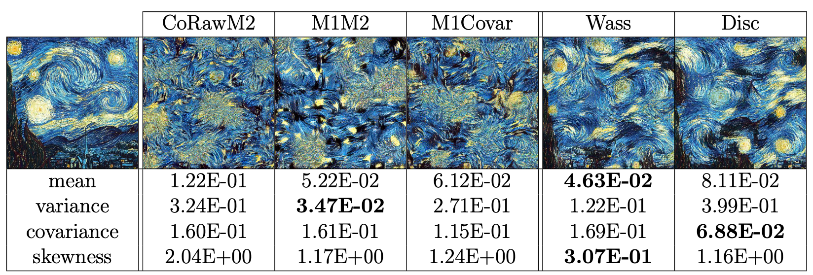

## About
Performs style transfer by using a neural network to discriminate between the style image features and the generated image features. Results yield higher quality transfers than contemporary methods.

There is also a PyTorch implementation of this code in the `pytorch` branch.

## Abstract
Style transfer boils down to a distribution matching problem, where the generated image must match the feature 
distribution of the style image within the same hidden layers of the pretrained model. To that end, we propose using 
statistical moments as metrics for assessing distribution matching. Current style transfer methods match the feature 
distributions using second order statistics, which has two major limitations: 1.) they cannot match the third or higher 
order moments, 2.) they cannot match the non-linear relationships between the dimensions. 
We propose two new methods of style transfer that address both of these limitations respectively, 
and significantly increase the quality in the mid-level and high-level textures of the style transfer. 

## Comparisons

Current methods of style transfer use second order statistics to match the feature distributions, 
Such methods include Adaptive Instance Normalization and mean square error of the Gramian matrices.

We propose two methods that significantly improve feature distribution matching, 
leading to improvements in the mid and high level textures of the style.

The first method defines the style loss as the unmixed Wasserstein distance. 
The second method defines the style loss dynamically with a neural network discriminator.
These two methods significantly improve matching the skewnesses (standardized 3rd moment) 
and covariances of the distributions respectively.  

## Example usage

#### Style representation
```python
python run.py --style_image=imgs/starry_night.jpg --imsize=512 --loss=wass 
```
Creates the style representation of the Starry Night painting using the unmixed Wasserstein distance between the features.
Improves mid-level textures of the style compared to typical second order methods.

```python
python run.py --style_image=imgs/starry_night.jpg --imsize=512 --disc_model=mlp 
```
Creates the style representation of the Starry Night painting using a multi-layer perceptron neural network to discriminate between the features.
Improves high-level textures of the style compared to typical second order methods.

#### Style transfer
```python
python run.py --style_image=imgs/la_muse.jpg --content_image=imgs/golden_gate.jpg --imsize=512 --loss=wass
```
Runs style transfer using the unmixed Wasserstein distance to match the features. 
The style image and content images are the La Muse painting and a picture of the golden gate bridge respectively. 

## Style losses
The code supports different types of style losses:
* `m1`: Mean square error between the means of the distribution
* `m1_m2`: Mean square error between the means and unmixed variances of the distributions
* `m1_covar`: Mean square error between the means and covariances of the distributions 
* `corawm2`: Mean square error between the mixed second raw moments of the distributions. 
This is equivalent to the original method of style transfer, which is the mean square error of the Gramian matrices of the distributions.
* `wass`: Unmixed Wasserstein distances between the distributions
* None: No loss is used. This is used when a neural network discriminator is used instead.

## Style discriminator
Set `disc_model=mlp` when you want to dynamically define the style loss with a neural network discriminator.

## Flag options
Run `python run.py --helpfull` to see all flag options. 

```
run.py:
  --loss: <m1|m1_m2|m1_covar|corawm2|wass>: type of statistical loss to use
    (optional)
  --loss_warmup: linear loss warmup
    (default: '0')
    (an integer)
  --sample_size: mini-batch sample size of the features per layer. defaults to
    using all the features per layer. if low on memory or want to speed up
    training, set this value to something like 1024
    (an integer)
  --[no]train_metrics: measure metrics during training
    (default: 'true')

model:
  --disc_model: <mlp|fast>: discriminator model architecture (optional)
  --feat_model: <vgg19|nasnetlarge|fast>: feature model architecture
    (default: 'vgg19')
  --ica: reduce the feature dimensions with FastICA (optional)
    (an integer)
  --layers: number of layers to use from the feature model
    (default: '5')
    (an integer)
  --pca: reduce the feature dimensions with PCA (optional)
    (an integer)
  --[no]scale: set the variance of the features to 1 based on the style features
    (default: 'false')
  --[no]shift: center the features based on the style features
    (default: 'false')
  --start_image: <rand|black>: image initialization
    (default: 'rand')
  --[no]whiten: whiten the components of PCA/ICA
    (default: 'false')

training:
  --beta1: optimizer first moment parameter
    (default: '0.9')
    (a number)
  --beta2: optimizer second moment parameter
    (default: '0.99')
    (a number)
  --[no]checkpoints: save transfer image every epoch
    (default: 'false')
  --[no]cosine_decay: use the cosine decay learning rate schedule
    (default: 'false')
  --disc_lr: discriminator learning rate
    (default: '0.01')
    (a number)
  --epsilon: epsilon
    (default: '1e-07')
    (a number)
  --gen_lr: generated image learning rate
    (default: '1.0')
    (a number)
  --steps_exec: steps per execution. larger values increases speed but decrease
    logging frequency. see the Tensorflow doc for more info
    (default: '1')
    (an integer)
  --train_steps: number of training steps
    (default: '10000')
    (an integer)
  --verbose: verbosity
    (default: '0')
    (an integer)

utils:
  --content_image: path to the content image
  --imsize: image size
    (an integer)
  --policy: <float32|mixed_bfloat16>: floating point precision policy
    (default: 'float32')
  --strategy: <tpu|multi_cpu>: distributed strategy. multi_cpu is mainly used
    for debugging purposes.
  --style_image: path to the style image
```

# Requirements
This code uses Python 3

### Required packages
* Tensorflow w/ Addons
* Numpy
* Matplotlib
* Pillow
* TQDM
